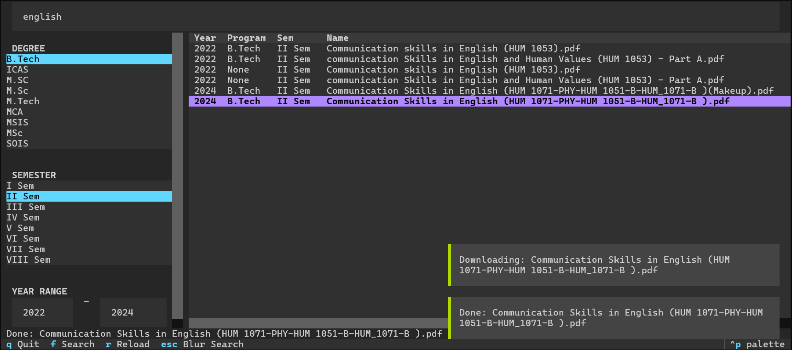

# pypfetcher

TUI for searching and downloading MIT Manipal question papers from the library portal.



## Quick Start

1. Install user-wide:
   ```bash
   git clone https://github.com/freebirdyeah/pypfetcher
   cd pypfetcher
   pip install --user -e .
   ```
2. Run from anywhere:
   ```bash
   pypfetcher
   ```

The app first uses `./index.json` if one exists in your current directory. Otherwise it falls back to the packaged `pypfetcher/index.json` that was installed with the tool.

## Local override (optional, for papers outside of 2022-25 range)

You can also build a one-off local index for the current directory. That local `./index.json` takes priority over the bundled one:

   ```bash
   python3 crawl.py --start-year 2021 --end-year 2023 --out index.json
   ```

## Controls

| Key   | Action            |
|-------|-------------------|
| Enter | Download selected |
| F     | Focus search      |
| Esc   | Leave search box  |
| R     | Reload index      |
| Q     | Quit              |

## Features

- Filters: Semester, Degree (Defaults to B.Tech), Year Range (2022-2025 default index).
- Instant ranked results as you type.
- Wget integration: Resumes partial downloads directly in current directory.
- Clean TUI: High-density layout with categorized filters.

## why bother making this?

- for some reason the old library portal is not accessible on campus wifi but `wget`ing pdfs from the site works.
- i was bored and i like TUIs (rip endsem prep)

---

*Disclaimer: please keep the library portal's bandwidth in mind*
